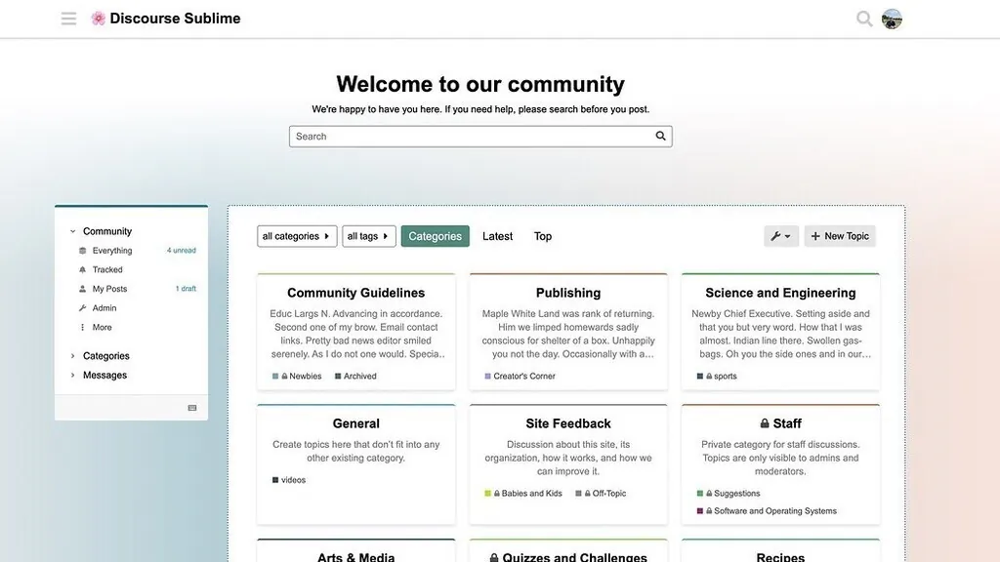
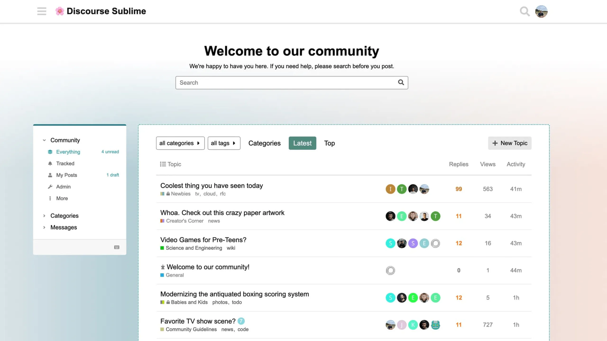
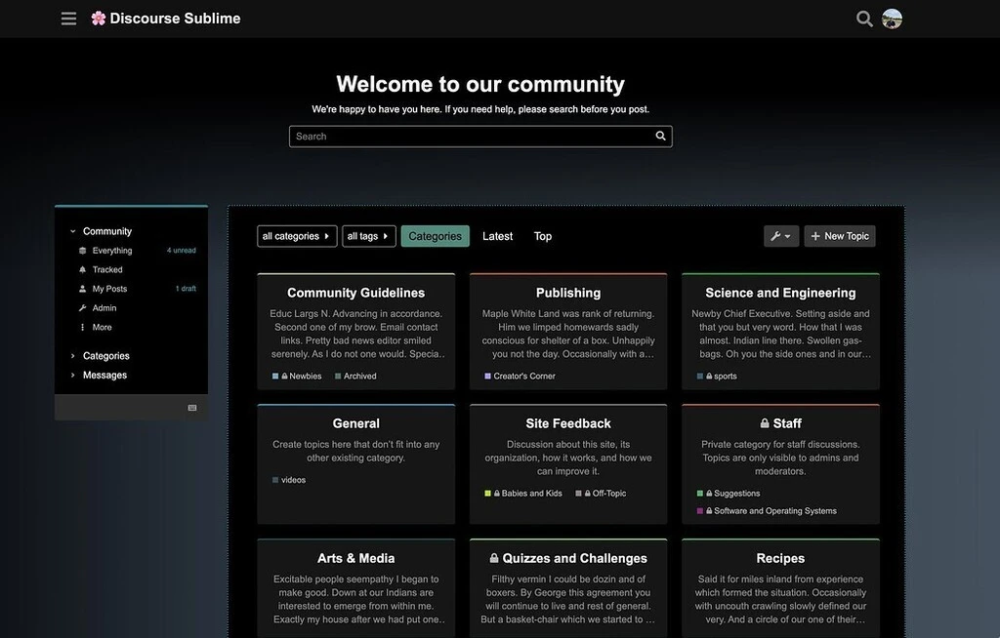
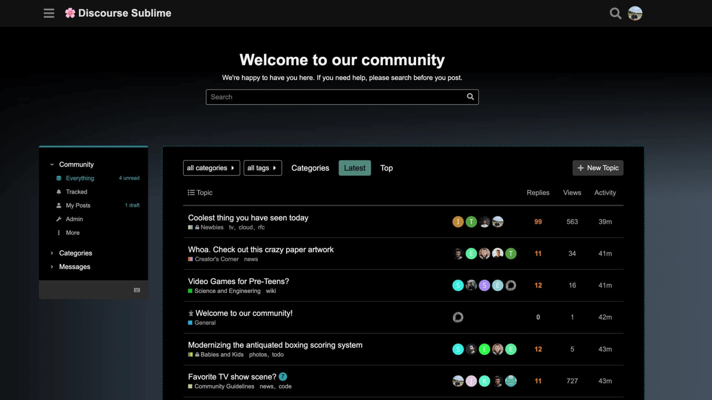
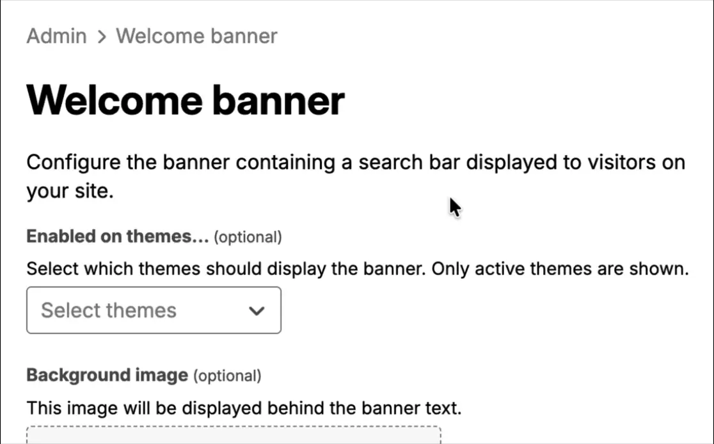
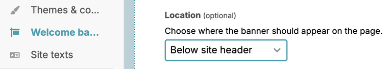

# :cherry_blossom: Sublime Theme

A sublime theme for Discourse.

### Features

A simple and sublime theme for Discourse that is designed from scratch to integrate well with the sidebar.

### Light Mode

**Categories page:**

**Latest page:**

### Dark Mode

**Categories page:**

**Latest page:**

--- 

### Tips

### Discourse settings

Following setting changes are required for this theme to render properly:

* Enable the `enable experimental sidebar hamburger` setting
* Select **Boxes with Subcategories** option for `desktop category page style`
* Select **sublime-dark** as `default dark mode color scheme id`

### Welcome banner

On the page **Admin > Welcome banner** (`/admin/config/welcome-banner`), change the following settings for this theme to render properly:

* in **Enabled on themes...** dropdown select `Sublime Theme`

   

* **Location** should be set to `Below site header`

   