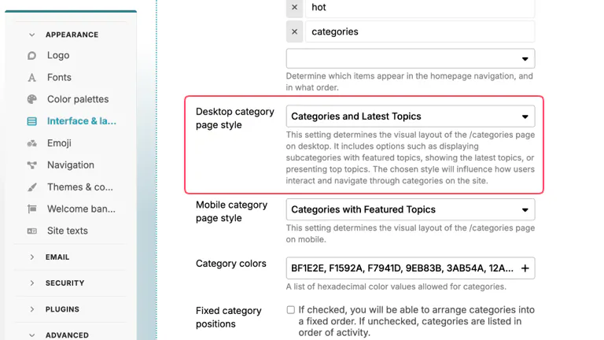
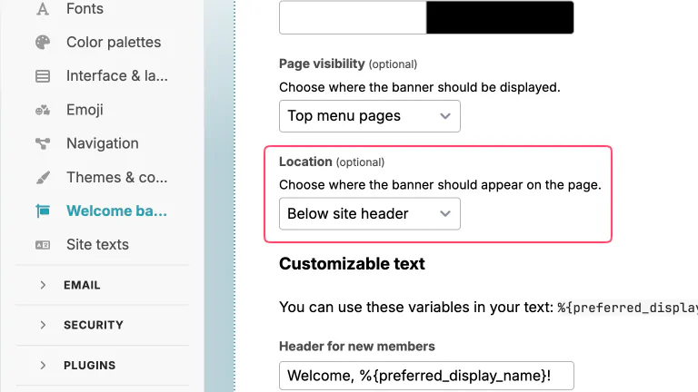

# :cherry_blossom: Sublime theme

A sublime theme for Discourse.

## Features

A simple and sublime theme for Discourse that is designed from scratch to integrate well with the sidebar.

### Light mode

**Categories page:**

**Latest page:**

### Dark mode

**Categories page:**

**Latest page:**

---

## Theme configuration

Change the following settings for this theme to render properly.

### Edit Theme

Go to **Admin > Themes & components** (`/admin/config/customize/themes`) page to edit Sublime theme.

- in **Dark color palette** dropdown select `sublime-dark`

  

### Interface & layout

Go to **Admin > Interface & layout** (`/admin/config/interface`) page.

- in **Desktop category page style** dropdown select `Boxes with Subcategories`

  

### Welcome banner

Go to **Admin > Welcome banner** (`/admin/config/welcome-banner`) page.

- in **Enabled on themes...** dropdown select `Sublime Theme`

  

- **Location** should be set to `Below site header`

  
